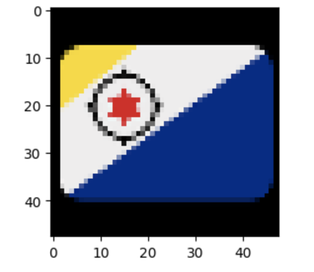
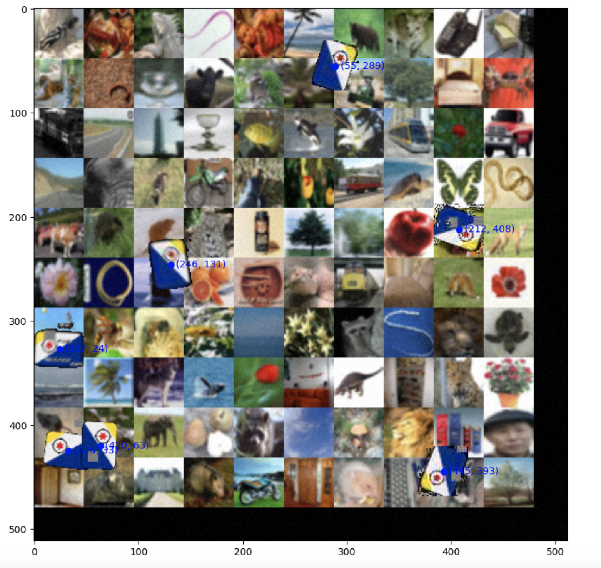

# EmojiHunt
This project uses Computer Vision techniques to locate occurences of a given emoji in an image.

## Implemented Approach
We implemented a novel approach for locating emojis in
images that is resilient to noise-based image augmentations. 
1. First segment the input image into an overlapping grid of equally
sized sub-images, with each sub-image being the same dimension
as the target emoji. 

2. Apply the Scale-Invariant Feature Transform (SIFT) algorithm on each local feature set of the image,
resulting in 1,521 keypoint comparisons between the current subimage and the target emoji. This allows us to identify candidate
keypoints that have a likely resemblance to the target emoji,
forming a strong foundation for further filtering using the
Bhattacharyya distance. 

3. Apply non-maximum suppression to keypoints to remove keypoints that identify the same emoji
4. Use histogram comparison to further filter keypoints

## Results
This implemented approach achieved a
final score of 195.92 with Cutout, CoarseSaltAndPepper.
JpegCompression, GaussianBlur, MotionBlur and Rot90
augmentations enabled. 

  
  
<i>Sample emoji image</i>

  
  
<i>The blue points are the locations of the emojis identified by our implementation</i>

